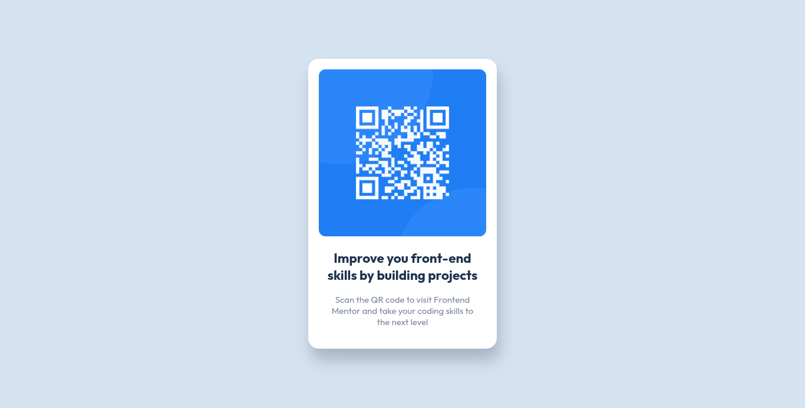
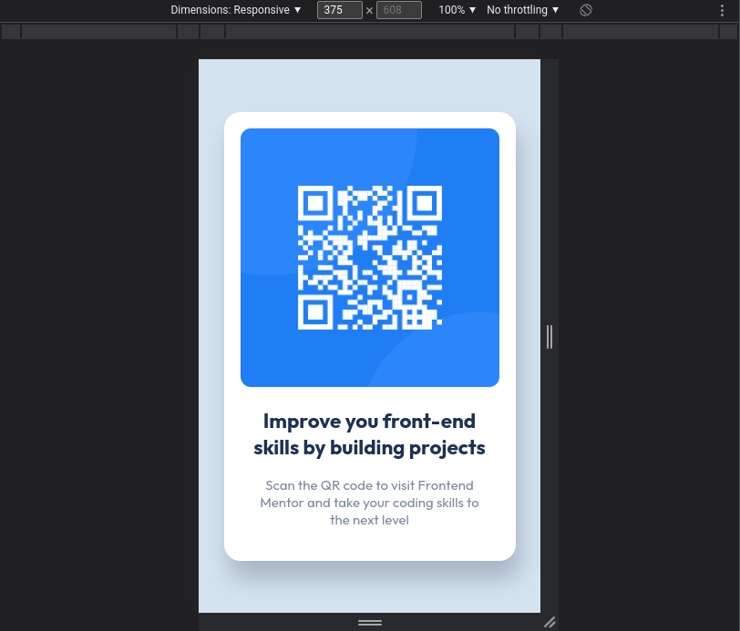

# Frontend Mentor - QR Code Component Solution!

This is a solution to the [QR code component challenge on Frontend Mentor](https://www.frontendmentor.io/challenges/qr-code-component-iux_sIO_H). Frontend Mentor challenges help you improve your coding skills by building realistic projects.

## Table of contents

- [Overview](#overview)
  - [Screenshot](#screenshot)
  - [Links](#links)
  - [Built with](#built-with)
  - [What I learned](#what-i-learned)
  - [CSS code](#css)
  - [Useful resources](#useful-resources)
- [Author](#author)
- [Acknowledgments](#acknowledgments)

## Overview

### Screenshot

### Desktop



### Mobile



### Links

- Solution URL: (https://github.com/kentbuno/QR-Code-Component)
- Live Site URL: (https://qr-code-component-kentbuno.vercel.app/)

### Built with

- Semantic HTML5 markup
- CSS custom properties
- Flexbox

### What I learned

I learned more about flexbox, box-shadow, and other properties that I'm using;

When it comes to difficulty, I had a hard time with pixel sizes, but overall it's a fun challenge.

Any comments about my code are well appreciated and will be implemented.

## CSS

```css
@import url("https://fonts.googleapis.com/css2?family=Outfit:wght@400;700&display=swap");
* {
  padding: 0;
  margin: 0;
  box-sizing: border-box;
  font-family: "Outfit", sans-serif;
  font-size: 15px;
}

:root {
  --white: hsl(0, 0%, 100%);
  --light-gray: hsl(212, 45%, 89%);
  --grayish-blue: hsl(220, 15%, 55%);
  --dark-gray: hsl(218, 44%, 22%);
  --shadow: hsl(220, 15%, 55%, 0.5);
}

body {
  text-align: center;
  min-height: 100vh;
  background-color: var(--light-gray);
  display: flex;
  align-items: center;
  justify-content: center;
}

p {
  color: var(--grayish-blue);
  padding: 0 1rem 1.2rem 1rem;
}

h1 {
  color: var(--dark-gray);
  padding-block: 1.2rem;
  font-size: 1.5rem;
}

main {
  max-width: 320px;
  background-color: var(--white);
  padding: 1.2rem;
  border-radius: 1.2rem;
  box-shadow: 5px 20px 25px var(--shadow);
}

.qrcode {
  width: 100%;
  border-radius: 0.75rem;
}
```

### Useful resources

- [W3Schools](https://www.w3schools.com/w3css/defaulT.asp) - This helped me when I forget some css properties.

## Author

- Frontend Mentor - [@kentbuno](https://www.frontendmentor.io/profile/kentbuno)

## Acknowledgments

I want to personally thank the [Frontend Mentor](https://www.frontendmentor.io/home) website because it helps me learn and helps my learning journey enjoyable.
